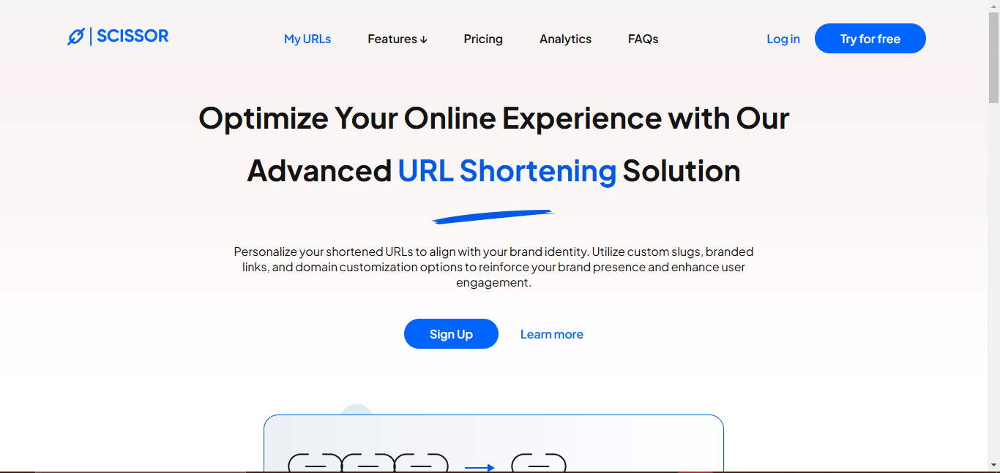

# AltSchool - Scissor Project Solution

### Table of contents
- [Overview](#overview)
  - [Screenshot](#screenshot)
  - [Links](#links)
  - [Built with](#built-with)
  - [What I learned](#what-i-learned)
  - [Continued development](#continued-development)
  - [Useful resources](#useful-resources)
- [Author](#author)

---

### Overview
**Scissors** is the hub of everything that has to do with your link management. We shorten your URLs, allow you creating custom ones for your personal, business, event usage. Our swift QR code creation, management and usage tracking with advance analytics for all of these is second to none.

### Screenshot

Here is a Screenshot of the final web page

### Links
Solution URL: [Click to check code](https://github.com/yenisaa/scissor)
Live Site URL: [Click to view](https://extraordinary-fairy-f69bdb.netlify.app/)

### Built with
- Semantic HTML5 markup
- CSS custom properties
- Flexbox

### What I learned
I finally understood how to use the css positions property properly.

### Useful resources
**[W3School](https://www.w3schools.com/)** - I learned an easy way to work with fonts using shorthands. I really liked this pattern and will use it going forward.

**[Stack Overflow](https://stackoverflow.com/)** - Stackoverflow is my go-to buddy whenever i encounter any challenge.

### Author
Github - [Isaiah Yenou](https://github.com/yenisaa)
Twitter - [Yenisa Ayomide](x.com/heisyenisa)